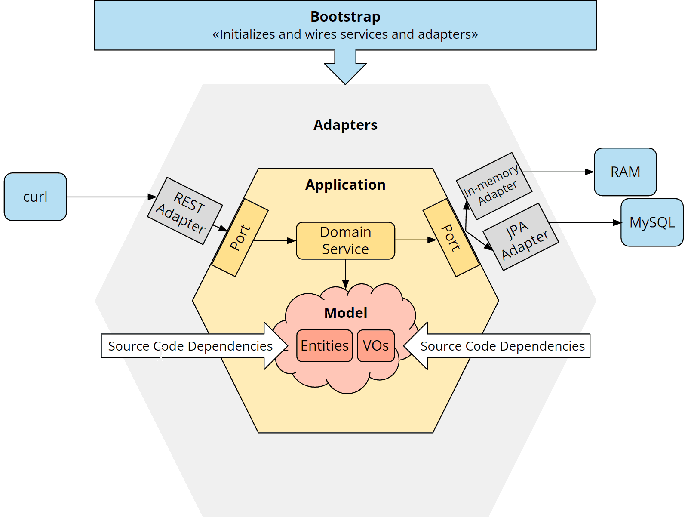

# Kotlin Hexagonal Architecture

Kotlin's implementation follows the [Hexagonal Architecture](https://www.happycoders.eu/software-craftsmanship/hexagonal-architecture/)
series of articles

---
The application provides the (simplified) backend for an online store that
includes the following functionalities:

1. Searching for products
2. Adding a product to the shopping cart
3. Retrieving the shopping cart with the products, their respective quantity, and the total price
4. Emptying the shopping cart

The core business logic we want to have in the application is as follow:

- The amount of a product added to the cart must be at least one.
- After adding a product, the total quantity of this product in the cart must
  not exceed the amount of the product available in the warehouse.

## Modules

- [models](./model/README.md)
- [application](./application/README.md)
- [adapter](./adapter/README.md)
- [bootstrap](./bootstrap/README.md)

## System Overview

## Endpoints

In this repository there is an [IntelliJ HTTP collection](sample-requests.http)
that can be used to communicate with the service.

To run the service, follow the instructions in the [bootstrap](./bootstrap/README.md)
module.
