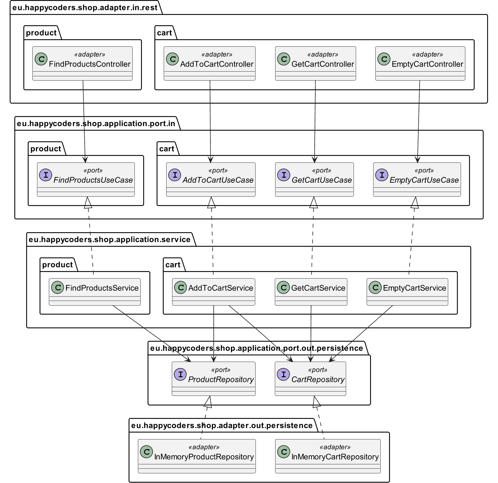
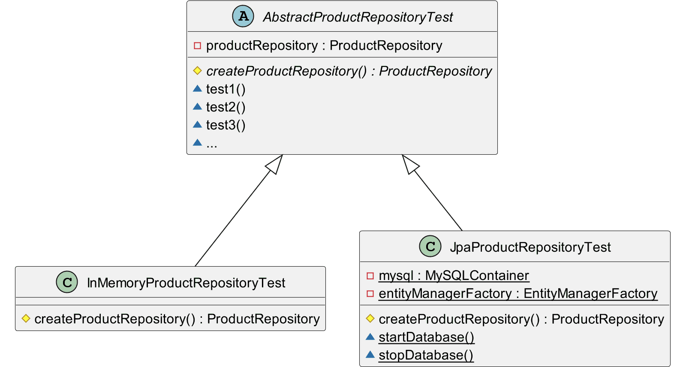

# Adapter

Contains the REST and persistence adapters.

## Class Diagram

We create a REST adapter (top row in the class diagram) for each of the primary
ports ([use cases](../application/src/main/kotlin/com/yonatankarp/shop/application/port/usecase))
and persistence adapter (bottom row) for each of the secondary ports
([repositories](../application/src/main/kotlin/com/yonatankarp/shop/application/port/out/persistence))

### Application

### Tests

