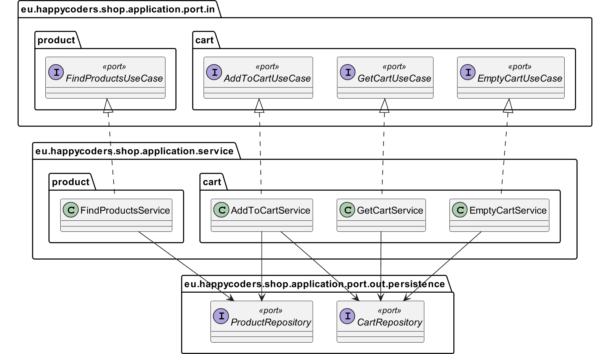

# Application

Contains:
- the ports
- the domain services that implement the use cases.

application and [model](../model/README.md) module together form the application core.

---

In the application hexagon, we implement ports and domain services for the
following use cases:

- Searching for products
- Adding a product to the shopping cart
- Retrieving the shopping cart with the products, their respective quantity, and the total price
- Emptying the shopping cart

## Class Diagram

