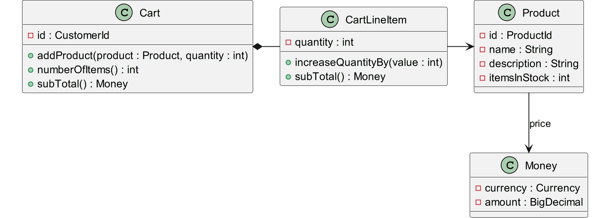

# Model

Contains the domain model, i.e. those classes that represent the shopping cart
and the products. According to domain-driven design, we will distinguish here
between Entities (have an identity and are mutable) and Value Objects (have no
identity and are immutable).

## Class Diagram

